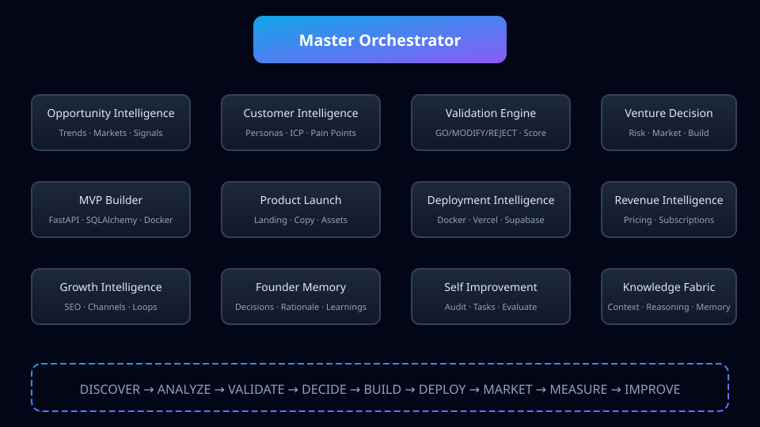
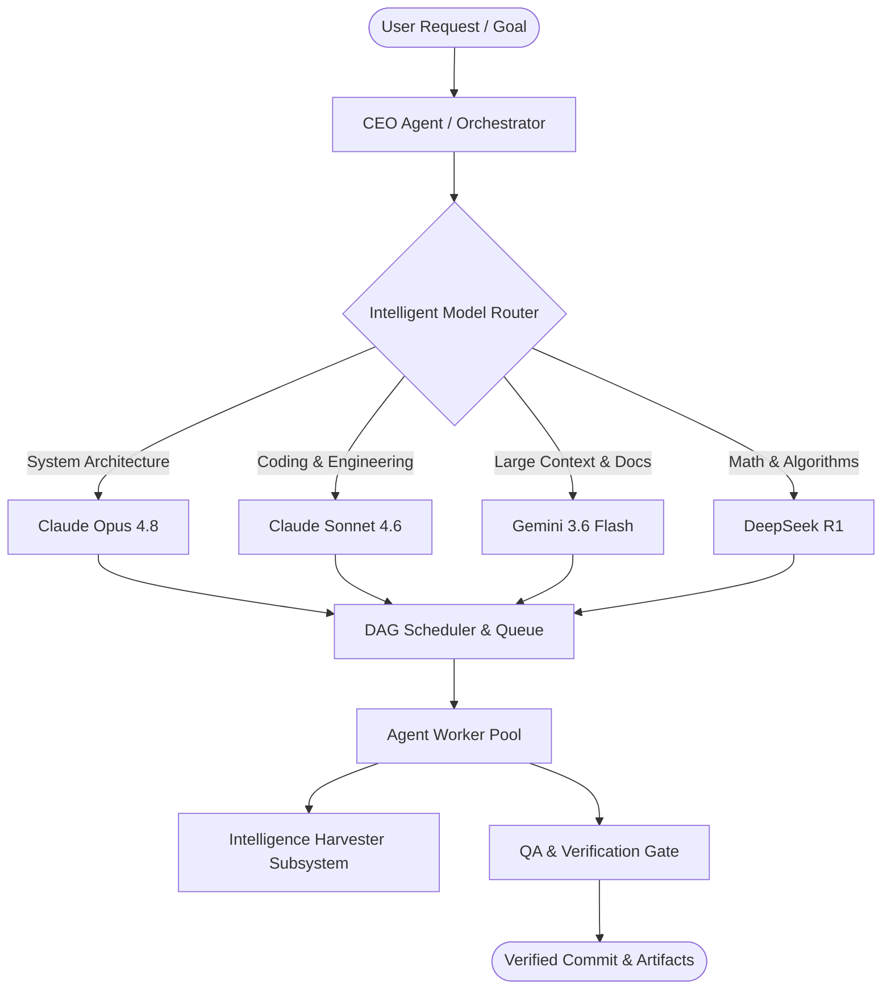

# Genesis Harness 🚀

[](https://github.com/mertgoevse-wq/Genesis_Harness/actions)
[](LICENSE)
[](https://python.org)
[](#architecture)
[](#multi-model-routing)

> **Genesis Harness** is an autonomous AI Operating System for multi-agent engineering, research automation, business intelligence, and continuous AI ecosystem evolution.

---

## 🌟 Key Features

- 🤖 **Autonomous Multi-Agent Orchestration**: Parallel execution of specialized agents (CEO, CTO, Architect, Coding, QA, Harvester) using Directed Acyclic Graph (DAG) dependency resolution.
- 🚦 **Dynamic Multi-Model Routing**: Intelligent prompt routing to **Claude Opus 4.8**, **Claude Sonnet 4.6**, **Gemini 3.6 Flash**, **Kimi**, or **DeepSeek R1** based on task complexity.
- 🌾 **Intelligence Harvester**: Continuous autonomous scanning of the GitHub AI ecosystem to extract state-of-the-art workflows, patterns, and prompt structures.
- 🛡️ **Autonomous Quality Gates**: Built-in structural verification (`verify_structure.ps1`), secret scanning, and automated evaluation metrics.
- 📜 **Automatic Session Logs**: Immutable logging of active agents, model routing decisions, git commit hashes, and step results.

---

## 🌐 Autonomous Venture Operating System

Genesis Harness is evolving into a fully autonomous venture creation platform. The latest evolution adds business intelligence subsystems that discover opportunities, decide venture viability, optimize revenue, plan deployments, and continuously improve themselves.

### Business Intelligence Subsystems

- **Opportunity Intelligence** (`opportunity_intelligence/`): Discovers market opportunities via research connectors, trend monitoring, competitor analysis, and SaaS opportunity detection.
- **Venture Decision Engine** (`venture_decision/`): Produces go/no-go verdicts with scoring across market size, competition, monetization, technical complexity, and risk.
- **Deployment Intelligence** (`deployment_intelligence/`): Generates deployment artifacts for Docker, Vercel, Supabase, and generic cloud providers.
- **Revenue Intelligence** (`revenue_intelligence/`): Recommends pricing tiers, subscription models, customer acquisition strategies, and growth experiments.
- **Self-Improvement Loop** (`self_improvement/`): Detects weaknesses, prioritizes improvements, and evaluates results.
- **Live Intelligence** (`live_intelligence/`): Modular connectors with caching and fallback for market data, SaaS trends, GitHub signals, and startup signals.
- **Product Validation Engine** (`product_validation_engine/`): Evaluates ideas and returns GO / MODIFY / REJECT verdicts with confidence scores.
- **Customer Intelligence** (`customer_intelligence/`): Personas, ideal customer profiles, pain points, objections, buying signals, and interview scripts.
- **Validation Engine** (`validation_engine/`): Continuous validation loop for landing pages, value proposition, pricing, and market demand.
- **Founder Decision Memory** (`memory_system/founder_memory/`): Persists decisions, successful patterns, failed ideas, and rationale.
- **Autonomous Improvement Loop** (`self_improvement/autonomous_improvement_loop.py`): Self-audit, weakness detection, task prioritization, and execution.
- **Growth Intelligence** (`growth_intelligence/`): Landing page optimization, SEO planning, acquisition channels, and growth experiments.

These subsystems are orchestrated by `orchestrator/master_orchestrator.py` and exposed through the Control Center API.

## 🏛️ System Architecture





---

## 🖼️ Visual Assets

| Asset | Path |
|---|---|
| Logo | [`docs/assets/logo.svg`](docs/assets/logo.svg) |
| Banner | [`docs/assets/banner.svg`](docs/assets/banner.svg) |
| Architecture Diagram | [`docs/assets/architecture.svg`](docs/assets/architecture.svg) |

> Screenshots of the Control Center and generated products will be added as the UI matures.


---

## 🧩 Subsystems Overview

### 1. Multi-Agent Orchestration (`/orchestration/`)
Includes a persistent `TaskQueue`, `DependencyResolver`, multi-threaded `AgentWorkerPool`, `PipelineRunner`, and `PipelineEvaluator`.

### 2. Intelligence Harvester (`/harvester/`)
A 7-module subsystem (`discovery`, `ranking`, `analysis`, `knowledge_graph`, `engine`, `prompt_lab`, `scheduler`) designed to ingest public AI ecosystem advancements without copying implementation code.

### 3. Capability & Skill System (`configs/`)
Formally declares agent capabilities, required skills, model preferences, cost tiers, and quality thresholds in `agent_registry.json` and `skill_registry.json`.

---

## 📊 Capability Benchmarks

Genesis Harness is continuously evaluated against real-world product creation and architectural benchmarks:

| Benchmark | Focus | Output | Status |
|---|---|---|---|
| **Benchmark 01** | Autonomous AI Product Creation (< 5€ budget) | `ReviewPilot AI` SaaS | ✅ PASSED |
| **Harvester Benchmark** | Abstraction & Pattern Extraction | Knowledge Graph Proposals | ✅ PASSED |

---

## 🚀 Quick Start

### Installation

```bash
git clone https://github.com/mertgoevse-wq/Genesis_Harness.git
cd Genesis_Harness
```

### Run Structure Verification Gate

```powershell
pwsh -File scripts/verify_structure.ps1
```

### Run Tests

```bash
python -m unittest discover -s tests -p "test_*.py"
```

---

## 🗺️ Roadmap

- [x] **Phase 1 & 2**: Technical & Business Agent Foundation
- [x] **Phase 3**: Autonomous Orchestration & Capability Benchmarking
- [x] **Phase 4**: Genesis Intelligence Harvester Architecture
- [x] **Phase 5**: Autonomous Multi-Agent Operating System & Model Router
- [ ] **Phase 6**: Autonomous Self-Correction & Live GitHub API Harvester Worker

---

## 🤝 Contributing

We welcome contributions! Please review our [.github/PULL_REQUEST_TEMPLATE.md](.github/PULL_REQUEST_TEMPLATE.md) and run `./scripts/verify_structure.ps1` before submitting pull requests.

---

## 📄 License

Distributed under the MIT License.
